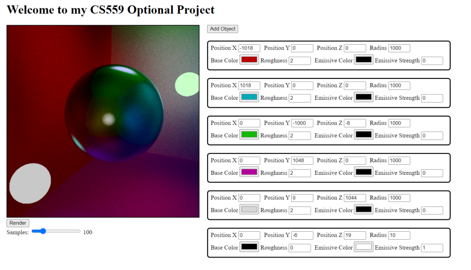
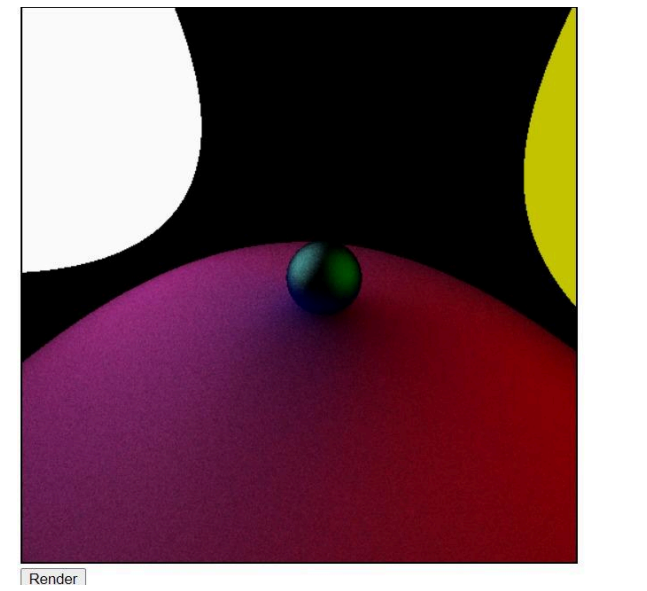
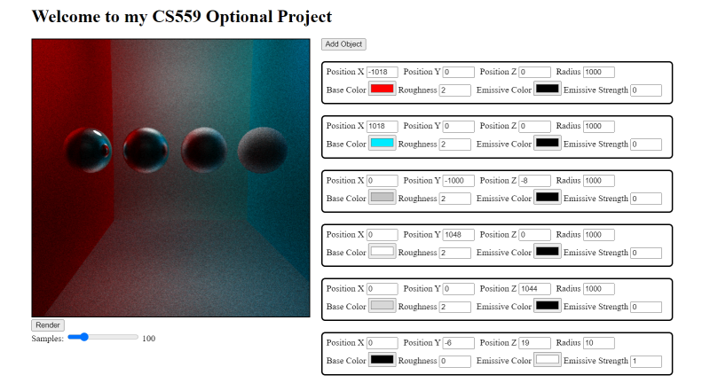
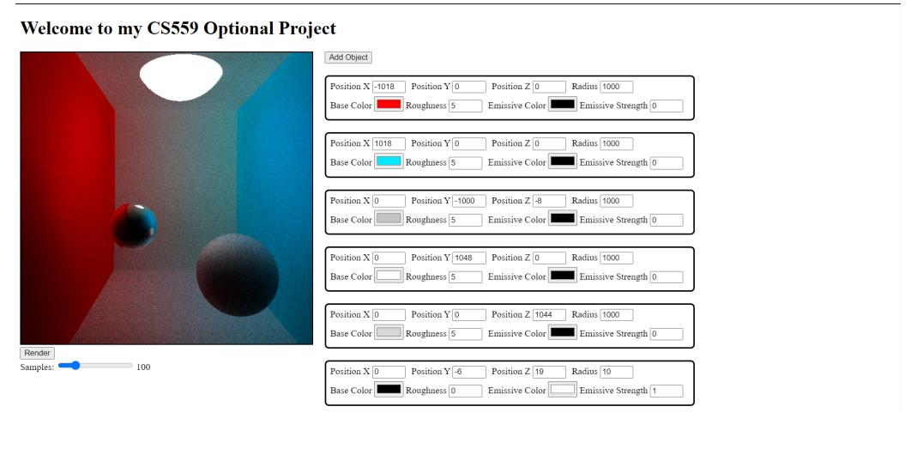

# Ray Tracer

This is a simple ray tracer built from scratch in JavaScript, using only the Canvas Drawing API.

## Table of Contents

- [Introduction](#introduction)
- [Features](#features)
- [Setup](#setup)
- [Usage](#usage)
- [Examples](#examples)

## Introduction

Ray tracing is a rendering technique that simulates the way light interacts with objects to produce realistic images. This project is a simple implementation of a ray tracer written in JavaScript for my CS559 final project. It utilizes the HTML5 Canvas API to render scenes directly in the browser.

## Features

- Basic ray tracing algorithm
- Pseudo realistic light reflection simulation
- Supports spheres of different sizes
- Shading accounts for emmissive, color, and roughness values
- Configurable scene setup
- Lightweight view port mode for real time configuration
- FPS counter
- Adjustable sampling for rendered outputs

## Setup

1. Clone the repository:

   ```sh
   git clone https://github.com/RSYashwanth/Ray-Tracer.git
   cd Ray-Tracer
   ```
2. Build a docker image:
   ```sh
   docker build -t <ImageName> .
   ```
3. Run docker
   ```sh
   docker run -p 80:80 <ImageName>
   ```
4. Open localhost on any browser of choice

## Usage

1. Click the `Add Object` button to place a new sphere at origin
2. Adjust object parameters such as position, size, color, roughness, emmissive color, and emmissive strength
3. Customize and configure scene to preference (don't forget to add emmissive sources else the scene will appear pitch black)
4. Use wasd keys and arrow keys to position and rotate the camera appropriately in view port mode
5. Adjust samples count for the final output (higher sample counts lead to a better output but takes longer to render)
6. Click the `Render` button and view the ray traced output (open console first for rendering progess)

## Examples
1. 
2. 
3. 
4. 
   
